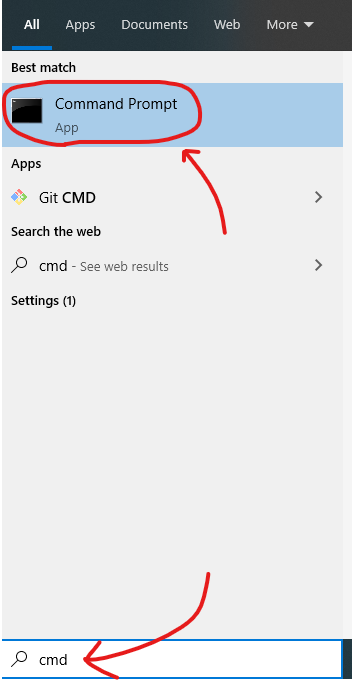
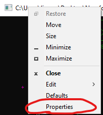
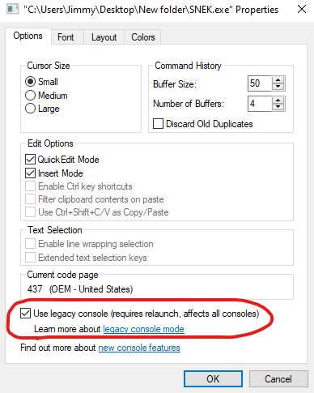

# SNEK
A game for the Windows Console!
+ Includes music and SFX!

## Setup
1. **Download** the [latest release](https://github.com/M-O-Marmalade/SNEK/releases/latest/download/SNEK.zip)
2. **Extract** all contents of SNEK.zip to one folder
3. **Run** "SNEK.exe", and *enjoy!*
- (**Install** [x86 VC Redist](https://aka.ms/vs/16/release/vc_redist.x86.exe) from Microsoft if the game is giving "Can't find ____.dll" errors)
- (**If the game window doesn't appear, you can follow the steps below to enable Legacy Console Mode, which might fix the issue.**)

### Fix: Invisible Window

1. **Open SNEK.exe.** If the game opens in the new Windows Terminal, set the "Default terminal application" to "Windows Console Host". Then click "save", and close the window.

2. **Open Windows Command Prompt** by searching *"cmd"* in the Windows Search bar

3. **Right Click** the Command Prompt window's title bar and select *"Properties"*

4. **Activate** Legacy Console mode in the *"Options"* tab, hit *"OK"* and close the Windows Console (Legacy Console mode applies to any/all Windows consoles you open from now on, so try to keep in mind that you have it enabled!)

5. **Open SNEK.exe again.** Enjoy the game!
