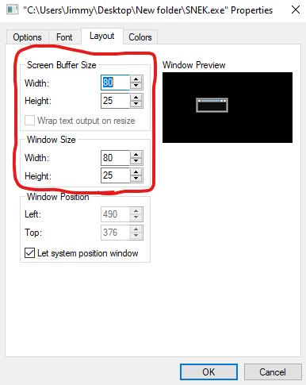

# SNEK
+ A classic game; now with multiplayer, music, portals, and a "lunge" ability!
+ Compatible with Windows 7 and up!

## HOW TO DOWNLOAD + PLAY
To play the game:

1. **Download** the [latest release](https://github.com/M-O-Marmalade/SNEK/releases/latest/download/SNEK.zip)
2. **Extract** all contents of SNEK.zip
3. **Run** "SNEK.exe", and *enjoy!*
- (**Install** [x86 VC Redist](https://aka.ms/vs/16/release/vc_redist.x86.exe) from Microsoft if the game is giving "Can't find ____.dll" errors)
- (**If you have jumbled graphics, or you hear sounds but no window shows up, follow the appropriate steps below.**)

### JUMBLED GRAPHICS FIX

1. **Open SNEK.exe.** If you see tabs at the top, click the down-arrow to the right of the + and the current tab, then open Settings (if there are no tabs, skip to Step 2). Set the "Default terminal application" to "Windows Console Host". Then click "save", and close the window.

2. **Open SNEK.exe again.** If the start screen shows correctly, you're done! Otherwise, right-click the title bar of the window, then select *"Properties"* (if the window is invisible, skip to the [Invisible Window Fix section](https://github.com/M-O-Marmalade/SNEK#invisible-window-fix-windows-10) below)

2. **Set** *"Screen Buffer Size"* and *"Window Size"* settings in the *"Layout"* tab to 80 Wide x 25 High

The game should now be working and displaying properly! :) You can play with the settings in the *"Font"* tab of the SNEK.exe properties to get a look/feel/size that you like :)

### INVISIBLE WINDOW FIX (Windows 10)

1. **Open Windows Command Prompt** by searching *"cmd"* in the Windows Search bar

2. **Right Click** the Command Prompt window's title bar and select *"Properties"*

3. **Activate** Legacy Console mode in the *"Options"* tab, hit *"OK"* and close the Windows Console (Legacy Console mode applies to any/all Windows consoles you open from now on, so try to keep in mind that you have it enabled!)

The game window should now display when opening SNEK.exe! If the graphics are jumbled
